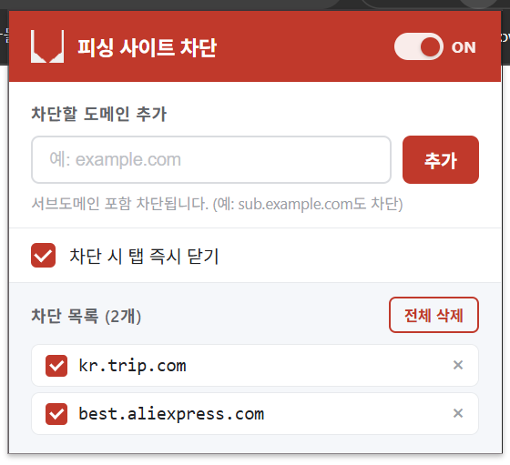

# Site Blacklist - 피싱 사이트 차단 Chrome 확장 프로그램

피싱 및 하이재킹 의심 사이트의 도메인을 등록하면, 해당 사이트 접속 시 자동으로 차단합니다.



## 주요 기능

- 차단할 도메인 직접 입력 또는 **현재 사이트 바로 추가** 버튼으로 등록
- 서브도메인 자동 포함 차단 (`example.com` 등록 시 `sub.example.com`도 차단)
- URL 붙여넣기 지원 (자동으로 도메인만 파싱)
- **도메인별 활성/비활성** — 목록의 각 항목을 개별적으로 체크박스로 켜고 끌 수 있음
- **전체 차단 ON/OFF** — 헤더 토글로 모든 차단을 일시 중단/재개
- **차단 시 동작 선택** (옵션)
  - 차단 안내 페이지로 이동 (기본)
  - 탭 즉시 닫기
- 도메인 삭제 / 전체 삭제
- Chrome 계정 간 설정 동기화 (`chrome.storage.sync`)

## 설치 방법

1. Chrome 주소창에 `chrome://extensions` 입력
2. 우측 상단 **개발자 모드** 토글 활성화
3. **압축해제된 확장 프로그램을 로드합니다** 클릭
4. 이 프로젝트 폴더 선택

## 사용 방법

1. 브라우저 우측 상단 확장 프로그램 아이콘 클릭
2. 입력창에 차단할 도메인 입력 후 **추가** 클릭 또는 `Enter`
   - 또는 **+ 현재 사이트 추가** 버튼으로 지금 보고 있는 사이트를 바로 등록
3. 목록의 체크박스로 도메인별 차단 활성/비활성 설정
4. 헤더의 ON/OFF 토글로 전체 차단 일시 중단/재개

## 파일 구조

```
site-blacklist/
├── manifest.json    # 확장 프로그램 설정 (Manifest V3)
├── background.js    # 서비스 워커 - URL 감지 및 차단 처리
├── popup.html       # 팝업 UI
├── popup.css        # 팝업 스타일
├── popup.js         # 팝업 동작 로직
├── blocked.html     # 차단 안내 페이지
└── icons/           # 확장 프로그램 아이콘
```

## 권한

| 권한 | 용도 |
|------|------|
| `tabs` | 현재 탭 도메인 조회, 차단 대상 탭 닫기 또는 리다이렉트 |
| `storage` | 차단 목록 및 옵션 저장 |
| `webNavigation` | 페이지 이동 전 URL 사전 감지 |
| `host_permissions` (`<all_urls>`) | 모든 사이트의 이동 감지 |
